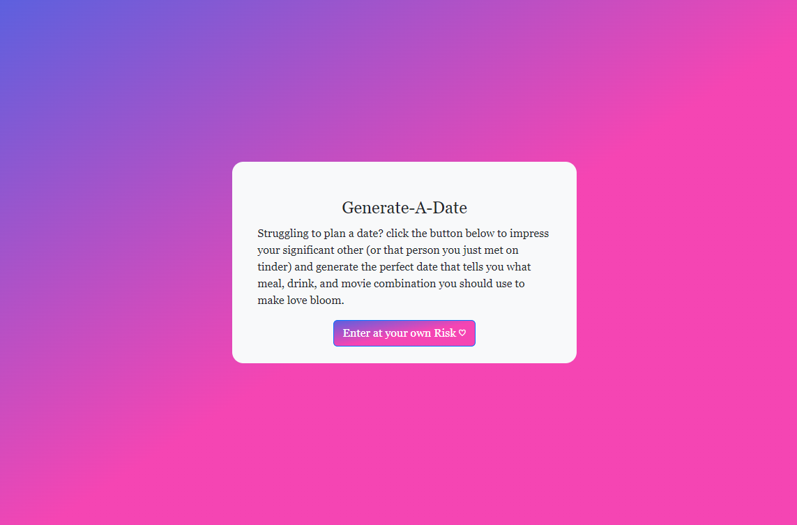
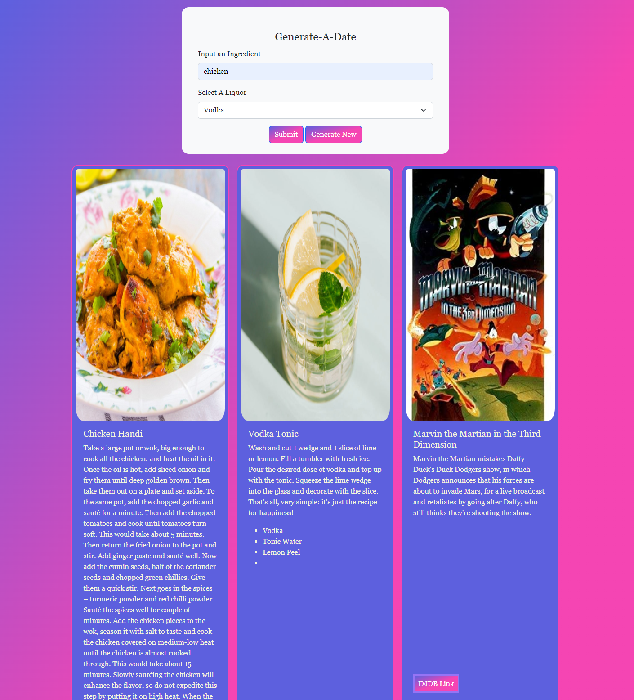

# Generate-a-Date

Link to our [Generate-A-Date](https://masonmarc.github.io/Generate-a-Date/) website.

## Description
This Generate-A-Date is a generator made for date ideas.

## Table Of Contents
+ [Visuals](#visuals)

## Visuals
+ Full view of entrance page

+ Put and ingredient in the input field.

+ Select a liquor type in the drop down menu.

+ Click on submit to generate a date.

+ If the results do not satisfy your needs, click "generate new" to generate new results.

+ At the bottom of each cards includes a link.

+ The food link will send you to google with recipe results.

+ The liquor link will send you to google as well with recipe results.

+ The movie link will send you to IMBD link with the movie information.